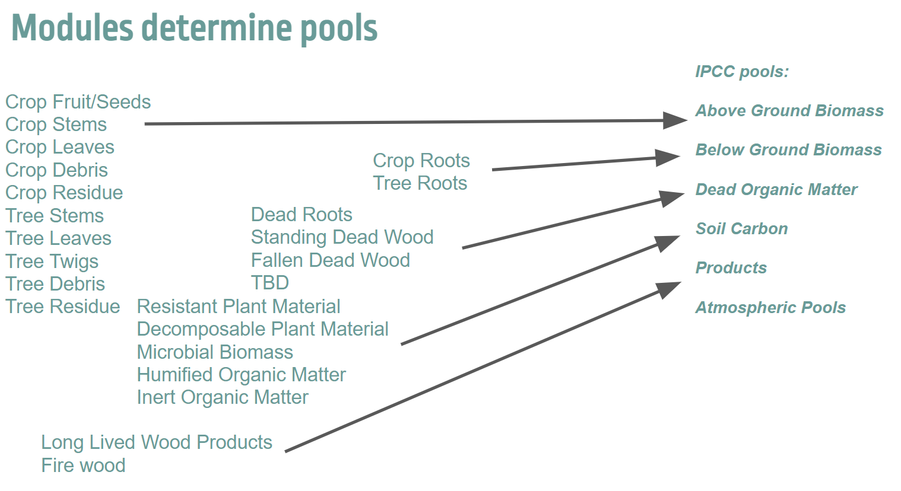
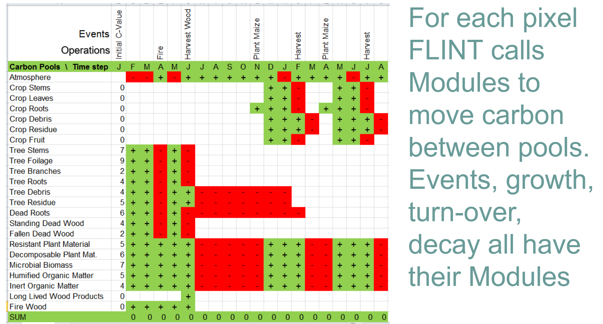
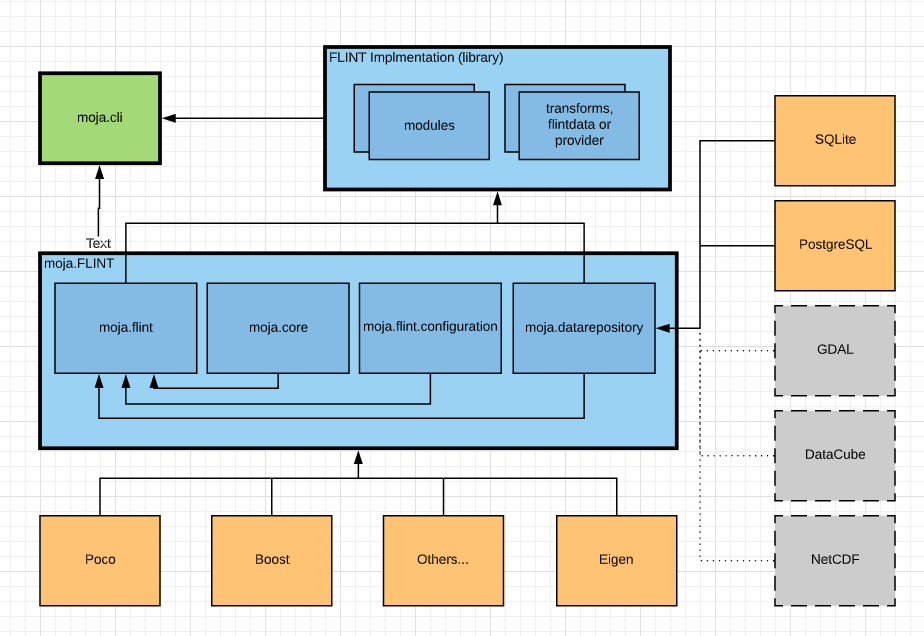
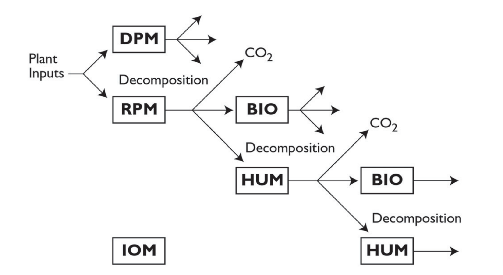
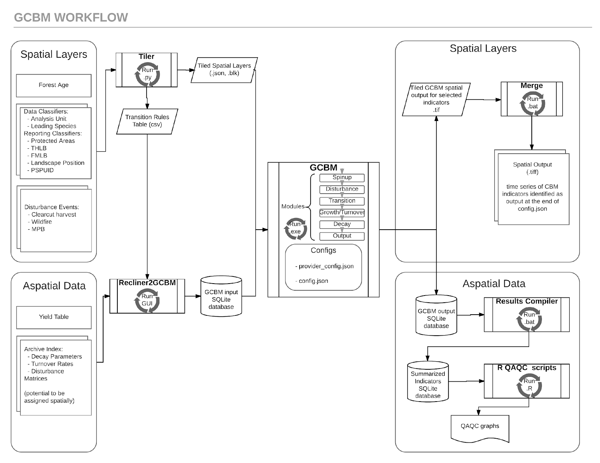
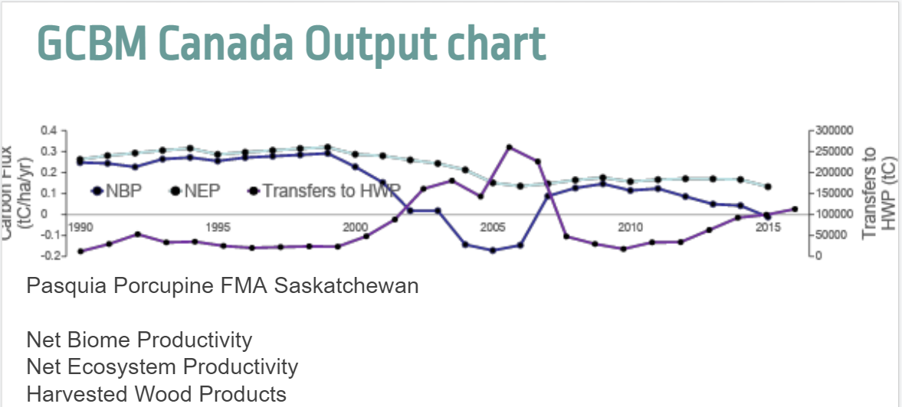
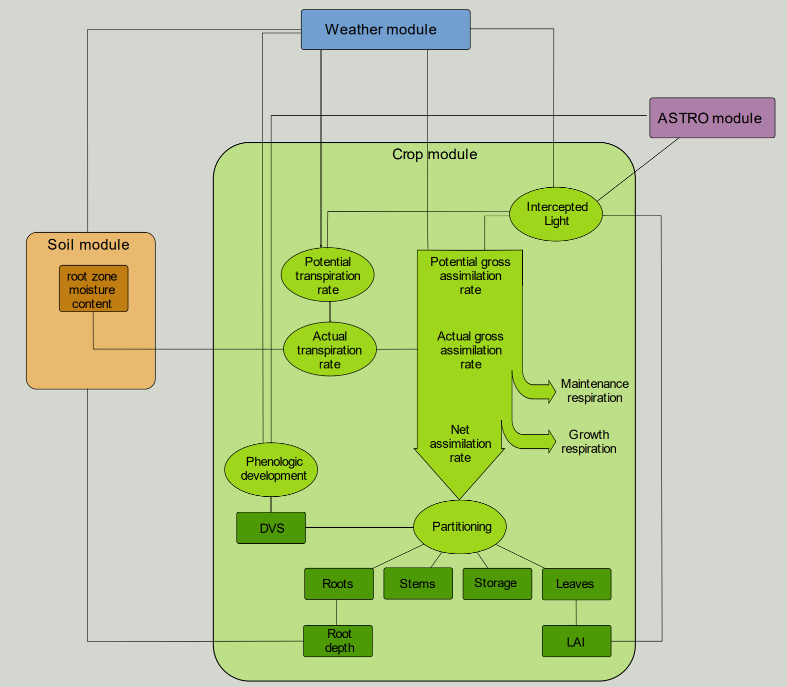
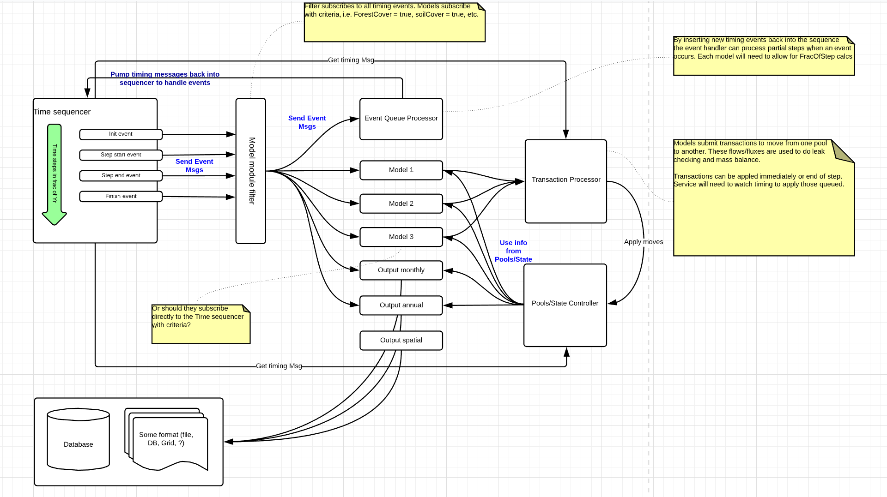

FLINT is a modular tool that supports better land management and helps reduce greenhouse gas (GHG) emissions worldwide, and allows multiple models and data required to better understand land management to be brought together in one place. 

A module is a self-contained set of operations that determine the state of, or change in, variables across a specified period of time for a single Simulation Unit in direct response to event notifications from the FLINT core system (Unit Controller). For example, the empirical forest growth module includes all the operations required to simulate biomass accumulation.

Modules are all written to work with the [`develop`](https://github.com/moja-global/FLINT/tree/develop) branch of the **FLINT** and any actively maintained branches will work with the most recent version (and are broken with old enough builds of the FLINT). The FLINT Application Programming Interface (API) has evolved over time, so some modules might be out of date. None of these modules require a custom fork of FLINT.

All the modules are divided into three different tiers according to the amount of information required, and the degree of analytical complexity. Three tiers are described for categorizing both emissions factors and activity data. Tier 1 is the basic method, frequently utilizing IPCC-recommended country-level defaults. While Tiers 2 and 3 are each more demanding in terms of complexity and data requirements.

## Background

These are the prerequistes you need to know before learning about **Modules**. This case study presumes that you are already familiar with **FLINT**. If not, see [the FLINT repository](https://github.com/moja-global/FLINT) to better understand **FLINT** before continuing.

## Index

1.  [How do modules work?](#how-do-modules-work)
2.  [Empirical forest growth module](#empirical-forest-growth-module)
3.  [Hybrid forest growth module](#hybrid-forest-growth-module)
4.  [Turnover module](#turnover-module)
5.  [Decomposition module](#decomposition-module)
6.  [RothC soil carbon module](#rothc-soil-carbon-module)
7.  [Chapman Richards module](#chapman-richards-module)
8. [GCBM module](#gcbm-module)
9. [WOFOST crop growth module](#wofost-crop-growth-module)
10. [Frequently asked questions](#frequently-asked-questions)

## How do modules work?

Each module reads (or is provided with – see Unit Controller) information about the current state variables and the data required to update the state variables, such as climate data or information about disturbances to simulate. Each module then performs the required calculations and returns information about the updates to apply to each of the state variables and C pools. 

For state variables such as age or height it is possible for modules to return the updated value but for all carbon pools and other fluxes the module returns an array (sparse matrix) of the proposed operations. This array will include the information about the source pool, the sink pool, and the amount (Mg ha-1 per time step) of the flux. Module-specific metadata regarding units and time step size are also required. This information is all returned to the Unit Controller.

In terms of the FLINT programming framework, there are internal and external modules. The internal modules tend to be generic utility modules, for example, for producing output tables. While external modules are regionally or nationally specific. By using modules and separating the generic and specific, FLINT’s framework remains highly flexible and new modules can be ‘plugged in’ as they are developed. Adding or developing modules is an advanced topic, which will not be covered here. If you would like to implement a new module, please reach out on `#modules-and-gbcm` on [Slack](https://join.slack.com/t/mojaglobal/shared_invite/zt-o6ta1ug0-rVLjAo460~d7JbZ~HpFFtw).

A Simulation unit is a unit for which a module is applied. A Simulation unit can represent a spatial area, such as a pixel or forest stand, or it can represent an emissions source, such as livestock. Here the Simulation unit refers to a geographically referenced area, it is known as a Land unit. The overall framework of FLINT manages the processing of Simulation units over time. Simulation units are the basis of all simulations run in FLINT.

### Modules

Modules are the building blocks of FLINT. They contain the operations that describe the ecological processes driving carbon changes in the landscape. This case study provides information regarding the major modules present in FLINT.

### Pools

A pool is a reservoir within which something can be stored and released. For example, a carbon pool is a reservoir from which carbon can be stored (sequestered and/or maintained) or emitted, such as debris. Within FLINT, each pool has attributed a value such as tonnes carbon, and at each time step, the FLINT can move stores from one pool to another using an operation. Here is an example of pools in a FLINT simulation.

| |
|:--:|
| Diagram depicting how modules determine pools in FLINT. |

### Operations

An operation is a process within FLINT that moves carbon stock between pools. Operations can reflect ongoing natural processes, such as growth, or specific events, whether natural or human-induced. Operations allow FLINT to track changes in carbon stock through time, including fluxes into and out of pools. For example, a harvest operation moves plant material to products and debris pools, whereas a wildfire operation moves plant material to debris and atmosphere pools.

### Events

Events are operations that occur intermittently (rather than for every time step in a simulation) resulting in the movement of carbon from one pool to another. Events include natural and anthropogenic events including: fire, harvesting, ploughing, and fertiliser application. These are coded for the FLINT as a module. Here is the relationship between Pools and Operations/ Events.

| |
|:--:|
| Diagram depicting how FLINT calls modules to move carbon between pools. |

### Temporal distribution

The temporal scale in FLINT is referred to as time-steps. Time-steps are lengths of time over which operations are reported. It is only at the end of a time-step that carbon can be moved from one pool to another.

The standard time-step in FLINT is one month. However it can be varied by the user. One month is the recommended time-step for modelling carbon.

### Synchronized events

In some circumstances, modules that are simulated for a particular Simulation Unit are dependent on other Simulation Units. That is, there is an interdependency between the Simulation Units. In these situations it is necessary for there to be a process that synchronizes across the related Simulation Units and this is known as synchronized events. The Synchronized Server in FLINT manages Synchronized events.

### Mass balance

The carbon cycle is based on the transfer of carbon molecules from one pool to another, where the molecules are not created, nor are they destroyed. As such, all outputs must be equal to the inputs. The system must be in balance. This is referred to as mass balance. Overall this is the high level design of FLINT.

| |
|:--:|
| Diagram depicting the high-level design of FLINT. |

## Existing FLINT modules

### Empirical Forest Growth Module

The empirical Forest growth module includes all the operations required to simulate the biomass accumulation. Specifically, it simulates the growth in carbon stock within a forest and its components through time. It is a standard module used in FLINT and is used within Chapman Richards Module. **Biomass** refers to the mass of living organisms, including plants, animals and microorganisms. **Biomass accumulation** is the net change in standing biomass from one time to another (g/m^2).

It runs at the **Monthly Step Interval**. It is based on the yield tables that present the **monthly growth increments** for a forest type. This data comes from research and experimentation and is called **empirical data**, thus giving the name of this module as empirical forest growth module. Yield Tables only include the **aboveground biomass**.

#### Inputs:

-   Time Step (Monthly)
-   Species
-   Age
-   Region
-   Forest type
-   Pool 1: Stemwood
-   Pool 2: Bark
-   Pool 3: Leaves
-   Pool 4: Coarse Root
-   Pool 5: Fine Roots
-   Rainfall in that region
-   Minimum and Maximum Temperature
-   [Vapour Pressure Deficit](https://en.wikipedia.org/wiki/Vapour-pressure_deficit)
-   Soil Water Holding Capacity

#### Outputs:

-   Calculated aboveground and belowground Biomass.

### Hybrid Forest Growth Module

The Hybrid Forest Growth Module calculates the biomass above and below the ground. These modules use physiological responses to environmental conditions to derive relationships that can be used to predict tree growth. These modules contain equations or series of equations to calculate biomass.

The Hybrid Forest Growth module represents a 3-PG model (Physiological Principles in Predicting Growth). 3-PG models require finer detailed data than is typically represented in empirical growth models. 3-PG models are better than the empirical models as they can be used with any landscape as long as its variables are present.

In `forestgrowthmodule.cpp`, the equation used is:

```
double ForestGrowthModule::calculate_above_ground_biomass(double age, double max, double k, double m) {
    return max * pow(1 - exp(-k * age), 1 / (1 - m));
}
```

### Turnover Module

Turnover is the movement from a living carbon pool to a dead carbon pool. This is due to the natural senescence of plant components . For example: A deciduous forest will have near 100 per cent turnover of leaves across a year – or an annual turnover rate of 0.99. The turnover rates will vary with vegetation types and the plant components. For example: A tree stem may have zero (0) annual turnover, while the leaves have one (1).

To determine the volume of turnover through time, a calculation similar to the one below is carried out:

```
Turnover= 1 - (1 - turnover_rate) ^ time
```

Within the FLINT, the maximum decay rate is set at 0.99 999 999 998, and the minimum decay rate is 0.000001. These restrictions are in place to ensure there are no invalid calculations (Example: dividing by zero) occurs in the system.

### Decomposition Module

Decomposition represents heterotrophic respiration of litter and soil organic matter. The process of modelling decomposition is akin to turnover in plant material, where a proportion of biomass in litter and soil organic matter decays through time. The rates of this will vary with location based on the prevailing environmental conditions.

### RothC Soil Carbon Module

RothC is a module used for simulating the turnover of soil carbon in non-waterlogged soils under different vegetation types. It is based on the decomposition of organic matter as it relates to mean temperature and moisture, and proportion of resistant and decomposable organic material. It runs on the monthly time step interval.

It is better than the other modules because its input data is readily available and there is considerable overlap with hybrid growth modules and WOFOST modules. For a detailed explanation and better understanding you can refer to the [RothC guide](https://www.verdeterreprod.fr/wp-content/uploads/2020/05/RothC_guide_WIN.pdf).

#### Inputs:

-   Time Step (Monthly).
-   Pool 1: Input of plant residue.
-   Pool 2: Input of farmyard manure.
-   Pool 3: Total organic carbon.
-   Pool 4: Microbial biomass carbon.
-   Rainfall.
-   Open pan evaporation.
-   Mean air temperature.
-   Clay content of soil.
-   Decomposability of incoming plant material.
-   Soil Cover.
-   Depth of soil layer sampled.

#### Output:

-   Total Organic Carbon.
-   Microbial Biomass Carbon.

| |
|:--:|
| Pictorial representation of RothC Module. |

### Chapman Richards Module

The Chapman Richards module is a tier-3 module. It is used for the estimation of greenhouse gas emissions and removals due to changes in biomass carbon for forests using Chapman Richards equation. We can find aboveground and belowground biomass using this module.

```
AGC = * [ 1 -  e ^ { -k *Age } ] ^ { ( 1 / (1-m) }
```

-   **AGC**: Above-ground stand carbon (Tonnes carbon per hectare).
-   **Max**: Asymptote – maximum peak carbon yield (Tonnes carbon per hectare).
-   **k**: Parameter used in modelling tree growth (dimensionless).
-   **Age**: Age of the forest (years).
-   **m**: Parameter used in modelling tree growth (dimensionless).

This module provides us the estimation of Aboveground biomass on the basis of the age of forests. Belowground biomass is calculated as a ratio from aboveground biomass. This equation is also used within the Forest Growth module. There is a separate repository for the [Chapman Richards module](https://github.com/moja-global/FLINT.Module.Chapman_Richards). It works on a monthly time step.

#### Input

-   Time Step (Monthly)
-   Dead Organic Matter
-   Soil organic matter
-   Pool 1 : Non-CO2 gases (The selection of carbon pools or non-CO2 gases for estimation will depend on the significance of the pool and tier selected for each land-use category)
-   Forest Age
-   Forest Type
-   Forest Cover
-   Soil Carbon
-   Spatial Location of Forest

#### Output

-   Above-ground biomass
-   Below-ground biomass

### GCBM Module

The GCBM is a set of science modules developed by the Canadian Forest Service (CFS) to run on the FLINT platform.

These are the same science modules used in the first generation tool ([CBM-CFS3](https://www.nrcan.gc.ca/climate-change/impacts-adaptations/climate-change-impacts-forests/carbon-accounting/carbon-budget-model/cbm-cfs3/13089)). Since the science and processes behind both tools are very similar, it is relatively easy to transition from CBM-CFS3 to GCBM.

The CBM-CFS3 is widely used throughout Canada and globally and its use is supported by the Canadian Forest Service of Natural Resources Canada.

The next generation GCBM is currently used by the CFS with a number of partner organizations to advance the science of forest carbon estimation and to support policy analyses such as the assessment of mitigation options in the forest sector.

In GCBM, forest inventory, and disturbance events are spatially explicit. The location of disturbances are explicit in spatial layers instead of being rule based. The GCBM Module is able to simulate large landscapes easily.

| |
|:--:|
| Diagram depicting the high-level overview of GCBM. |

The GCBM module is one of the country specific modules designed especially for Canada. It works at the **Annual Time step** interval. There is a special repository for the [GCBM Module](https://github.com/moja-global/moja.canada/tree/develop).

#### GCBM Modules

There are a large number of modules within the GCBM, some of which are optional depending on your simulation requirements. We have only included a short summary of these modules.

##### Canadian Model for Peatlands (CaMP)

The Canadian Model for Peatlands (CaMP) is a module for Greenhouse Gas (GHG) emissions. The CaMP was designed as a module for the spatially-explicit GCBM. The CaMP is a site- to national-level peatland carbon model developed to better estimate GHG emissions across a range of peatland types in Canada.

Different events are triggered on the basis of the land type found during simulation. For example, if the land type is peatland then this triggers a peatland disturbance event. Otherwise it triggers a regular CBM disturbance event.

> Bona, Kelly Ann, et al. "The Canadian Model for Peatlands (CaMP): A peatland carbon model for national greenhouse gas reporting." Ecological Modelling 431 (2020): 109164.

##### Decay Module

This module calculates the annual decay and turnover on a set of dead organic matter pools present in the GCBM. The data requirements for the Decay Module are:
    
- A table named "decay_parameters", with one set of decay parameters for each of the enumerated  Dead Organic Matter (DOM) pools in the DOMPool.

- Scalar "mean_annual_temperature". This is the mean annual temperature of the environment.

- Scalar "SlowMixingRate". This is the amount that has moved from slow aboveground to slow belowground annually.

##### Moss Decay Module

This module is used for moss related computing. This module determines whether the moss pool is decaying. Different decay rates can be applied to different pools.

##### Moss Disturbance Module

This module responds to the fire disturbance events in GCBM. This module is responsible for transferring carbon content from moss pools to the atmospheric emission pool. It gets the input data from the variable: ```moss_fire_parameters```.

##### Moss Growth Module

This module is responsible for the growth of moss pools.

##### Moss Turnover Module

This module is responsible for the turnover of moss pools. The movement between the moss live pool and the moss past pool. This module calculates the movement between the moss live and pools, in response to the transfer rates assocated with different simulation events.

##### Peatland after GCBM Module

This module is triggered after GCBM simulation on a land unit, and prepares the land unit to simulate the peatland simulation. It transfers carbon from some GCBM pools to the peatland pools. It is called after finishing the regular GCBM simulation.

##### Peatland Decay Module

This module is responsible for peatland decay. It uses the variables: ```peatland_decay_parameters``` and ```peatland_turnover_parameters```. It also uses various parameters like: mean annual temperature, annual water table depth, total initial carbon.

##### Peatland Disturbance Module

This module responds to the historical and last disturbance events in the GCBM spinup. It alters the water table depth according to the disturbance type.

##### Peatland Growth Module

This module gets the data from the variables: ```peatland_growth_parameters```, ```peatland_turnover_parameters``` and ```peatland_growth_curve```. It simulates the various growth cycles, growth curves and also sets the component value for the pools.  For example: woody layer, moss layer and many more.

##### Tree Growth Module

This module deals with the small trees growth curve ID like black spruce. There is a peatland pre-defined forest growth curve of black spruce. It takes the current eco boundary variable name and then checks if it was changed or just set. As output, it updates the small tree growth curve parameter. It calculates the biomass transfer between various tree pools like stem wood, coarse root, with the help of the age of the small tree.

##### Stand Maturity Module

This module creates the stand growth curve. It gets the standard growth curve ID associated with the pixel, processes it and converts the yield volume to carbon curves.

##### Tree Yield Table Module

A yield table is a table which indicates the volume of wood per unit area of forest that is expected to be at different ages compared to other trees.

This module creates the yield tables for multiple hardwood and softwood species components depending upon the age of the tree, species type and species ID of the tree.

It also gives a summary of total volume of the species growth curve and creates a yield table for a specific type with the transform result yield data.

##### Yield Table Growth Module

This module creates and updates yield tables for different land types like peatland and moss, and transfers content between various biomass pools. It requires the growth yield curve to work which it retrieves from the stand growth curve factory file. It also performs turnover and decay of different pools in its one time step.

The [Turnover module](#turnover-module) and the [Decomposition module](#decomposition-module) are also used as a pre-requisite for the GCBM.

#### Input

There are no specific inputs to the GCBM module. It contains several modules which have multiple inputs and they all interact with each other to produce the output of GCBM in the form of maps and tables.

#### Output

GCBM gives us the estimate of carbon flux generated, Aboveground Biomass etc.

| |
|:--:|
| Diagram depicting how the GCBM output is displayed on a chart. |

| |
|:--:|
| Diagram depicting how the GCBM output is displayed on a map. |

There is a special repository to visualize the output generated by GCBM [Taswira](https://github.com/moja-global/GCBM.Visualisation_Tool).

### Wofost Crop Growth Module

WOFOST (WOrld FOod STudies) is a mechanistic module that simulates crop growth on the basis of photosynthesis, respiration and the prevailing environmental conditions. It is similar to the hybrid forest growth module.

It is similar to the [DayCent](https://en.wikipedia.org/wiki/DayCent). This module runs on a **Daily time step** and allows users to model the potential production, attainable production and actual production for a given site (region). The simulation runs from sowing to maturity and is based on the response of crop to weather (all production levels) and soil moisture conditions.

#### Inputs:

-   Time step (Daily)
-   Crop Type
-   Pool 1: stem
-   Pool 2: Leaves
-   Pool 3: Storage Organs
-   Pool 4: Roots
-   Maximum and Minimum Temperature
-   Global Radiation

#### Outputs:

- It calculates how much carbon moves between pools.

| |
|:--:|
| Pictorial representation of WOFOST Module. |

## Frequently asked questions

1. Do Modules need a specific version to run? 

    The modules work with the [`develop`](https://github.com/moja-global/FLINT/tree/develop) branch of the **FLINT**. The actively maintained modules work with the most recent version (and are likely broken with old enough builds of the FLINT). The API has evolved a bit over time, so some modules might have fallen out of date but nothing requires a custom fork of FLINT.

2. Why are Modules important?

    Without the modules, the FLINT cannot produce outputs. Each user will have different data and policy and reporting needs. Based on these needs users will attach the appropriate modules and data to the FLINT. 

3. Where can I learn more about modules?

    For getting a deep understanding of modules, you have to understand how things work inside a module and what are the different operations used in FLINT and how it is being managed and developed. The [Metric and carbon calculation modules docs](https://github.com/moja-global/FLINT.Modules.docs/blob/develop/modules.md) offer an advanced level of understanding.

4. Can I implement a module from scratch?

    Here's an example of a custom made module - [**Agricultural soil module**](https://github.com/moja-global/FLINT.Module.Agricultural_Soil_Model). This project involves specifically implementing the agricultural soils model that is used to estimate non-CO2 GHG emissions from agricultural practices. You can visit the [module development docs](https://github.com/moja-global/FLINT.Modules.docs/blob/develop/modules.md#developing-modules) to know how to implement a single, simple module from scratch.
f
5. How do modules interact with each other?

    Different Modules are configured through Local Domain Controller and sequencer which decides the flow of modules. Here is a **Sequence diagram** for better understanding.

    | |
    |:--:|
    | Diagram depicting the control flow diagram of how FLINT modules interact with each other. |
