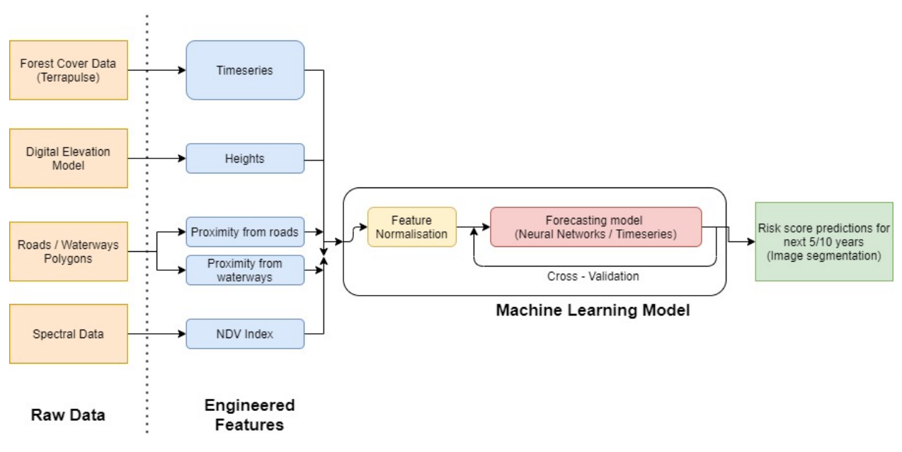
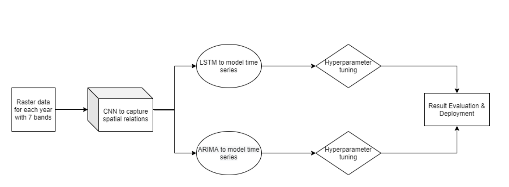
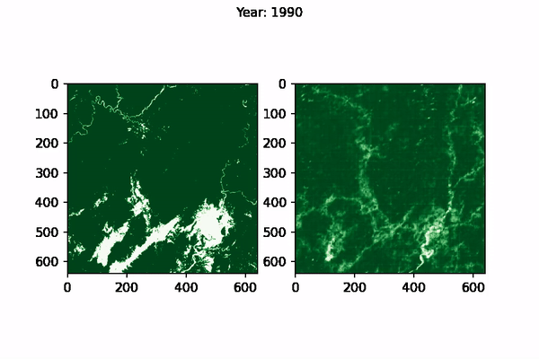

Agriculture, forestry, and other land-use types account for 23% of global greenhouse gas emissions. Moja global provides tools for estimating emissions and removals of greenhouse gases (GHG) from the land sector. Deforestation is one of the primary sources of GHG emissions from the land sector. Large amounts of carbon are stored in trees, absorbed from the atmosphere over decades, if not centuries. When the trees are cut down and used as firewood (or other short-term uses), the carbon stored in the trees is released into the atmosphere. Moreover, the dead trees stop removing CO2 from the atmosphere.

Investment to avoid deforestation is essential to reduce climate change, and it becomes more important as we reduce other emissions. Such investment is currently hampered because accurate predictions of deforestation are not available. This project proposes to develop an algorithm based on machine learning (ML) to predict the likelihood of a particular pixel in the landscape being deforested over the projection period. The predicted deforestation for each pixel can be aggregated to obtain expected deforestation for a project area, administrative region, or a whole country, which is more informative for the policy-building agencies.

AI forms the backbone of the entire project proposal. To make accurate forest-cover change predictions at the pixel level using multi-spectral time-series satellite image data that is huge (1 TB) in size, deep learning is the best available solution.

What makes this project unique? The approach of combining multi-spectral satellite data of forest cover with on-ground images and implementing State-of-the-Art Deep Learning models to predict deforestation is unique and has not been tried before. Additionally, Uganda has never been covered by a similar machine learning approach for deforestation analysis. Previous methods either use retrospective accounting of forest loss or statistical estimates, which are not accurate. We believe that a predictive approach driven by AI would be more accurate and better for decision-making.

## Approach

Myanmar and the Philippines were chosen as the pilot areas for this project. There is a timeline of 1986 - 2019 (for Myanmar) and 1990 - 2019 (for the Philippines) because of the latest, sufficient, and high-quality data. The situation of both these countries is quite similar as well. The forest cover has been reduced, and accurate predictions of future deforestation can help identify high-risk areas. It would allow the concerned authorities with taking appropriate preventive measures.

The overall project was broken down in the following phases:

1. **Data pre-processing and feature engineering**: The data was collected from various sources and processed to mitigate null values, class imbalance and scale differences. It was followed by incorporating 14 features, which include spectral bands, topographical features and geographical factors.

2. **Baseline model implementation**: We implemented standard machine learning algorithms like Logistic Regression, Random Forest, SGD Classifier (Stochastic Gradient Descent) and Hierarchical Bayesian framework. The Random Forest algorithm outperformed other algorithms with an F1 score of 0.6.

3.**Deep learning model implementation**: We implemented different architectures of CNN-LSTM (Convolutional Neural Networks - Long Short Term Memory) with the best-case AUC (Area under the Receiver Operating Curve) score of 0.87 (on a scale of 0-1, with a higher score implying better results) for test data (for predicting 1-year into the future) in the case of Myanmar and 0.83 for the Philippines.

## Data Pre-Processing & Feature extraction

The primary dataset for Myanmar has been retrieved from the forest cover change data (gain/loss of forest cover at pixel level). The data present in the Tagged Image File Format covers the forest cover information for that year. The images retrieved from Terrapulse were compiled and processed to match the LandSAT imagery standards. Apart from this, the Google Earth Spectral Dataset was utilized.

The primary dataset for the Philippines has been retrieved from Terrapulse, which contains forest cover data from 1990 to 2019. We used the Google Earth Spectral Dataset to augment the Terrapulse dataset and sent it for further processing.

The extracted data from the Google Earth Landsat consisted of bands that allowed us to analyze forest cover changes over time. By the end of the pre-processing and feature extraction step, we capitalized on some of the features as per the available literature on forestry:

- SRTM elevation of the landscape.
- Proximity of a location from the nearest road.
- Proximity of a location from the nearest waterway.

## Baseline model implementation

After data collection, pre-processing, and feature extraction, we paved the path forward to utilize standard machine learning algorithms. The base model implementation further paves the way forward for use with deep learning algorithms and architecture. The results obtained after implementing a standard machine learning pipeline are showcased below:

| Without resampling | Logistic Regression | Random Forest | SGD |
| ------------------ | ------------------- | ------------- | ----- |
| Accuracy | 0.95 | 0.97 | 0.95 |
| Precision | 1 | 0.993 | 0.998 |
| F1 | 0.947 | 0.97 | 0.947 |
| Recall | 0 | 0.6 | 0.008 |

> Results obtained without resampling the data to account for class imbalance.

| With downsampling | Logistic Regression | Random Forest | SGD |
| ----------------- | ------------------- | ------------- | ----- |
| Accuracy | 0.63 | 0.86 | 0.53 |
| Precision | 0.63 | 0.86 | 0.53 |
| F1 | 0.96 | 0.99 | 0.97 |
| Recall | 0.136 | 0.42 | 0.132 |

> Results obtained after downsampling the data to account for class imbalance.

Random Forest was discovered as the one algorithm that constantly outperformed other models. It included the fact that Random forest can better predict on a class imbalanced set than linear models. Random Forest can also learn class imbalance on unsampled data, giving the best performance amongst the three baseline models.

A Hierarchical Bayesian Framework model was also implemented, which achieved an overall accuracy of 84%. The results obtained for Myanmar by implementing Hierarchical Bayesian Framework are:

| Overall accuracy | Figure of merit | Sensitivity | Specificity | True skill statistic | Cohen's kappa |
| ---------------- | --------------- | ----------- | ----------- | -------------------- | ------------- |
| 0.84 | 0.1 | 0.17 | 0.92 | 0.09 | 0.1 |

> Results obtained for Myanmar by implementing Hierarchical Bayesian Framework.

| |
|:--:|
| Diagram depicting the broad methodology followed in this project |

## Deep learning model implementation

### Myanmar

We implemented the model architecture after signifying an Area of Interest (AoI) selection, accounting for the class imbalance and dimensionality reduction using PCA. A Convolutional Neural Network processed the time-series data to capture the spatial relations in the dataset. It is followed by parallel implementation of Long Short Term Memory and Auto-Regressive Integrated Moving Average to capture the time-series component of the data. We did the hyperparameter tuning along with a lot of hit-and-trials, and we measured the performance accordingly.

### Philippines

Similarly, for the Philippines, the dataset pre-processing involved removing null patches, resampling, and applying principal component analysis for creating shards. We utilized continuous probabilistic target variables since the loss (RMSE) converged quickly around Epoch 9, which we quickly discovered to be an issue with the architecture.

|  |
|:--:|
| Deep Learning workflow used for this project |

## Reports

The visualisation of CNN Predictions as well as the Ground Truth can be seen below, for Myanmar:

|  |
|:--:|
| Ground Truth (left) vs Model prediction (right) for Myanmar from 1995-2015 |

For the Philippines, we obtained a best-case train AUC of 0.8316 and a test AUC of 0.7706. It was made possible after normalizing the dataset with global min-max values of the band values in the Philippines and including a Conv2D layer via permute.

## Conclusion

The current scope of work successfully demonstrates the effectiveness of Conv-LSTM for accurately predicting forest cover change for Myanmar and the Philippines. The model aims at improving the performance of GHG estimation models, which rely on accurate deforestation prediction to estimate the GHG emissions from the land sector. International organizations like IPCC and local governments can utilize the results to estimate GHG emissions from the land-use sector.

In the future, the project can include Spatio-temporal models, which might give good results, such as GAN-LSTMs. It also includes universal models that are trained for one country and can be extended to another country. We also have an added scope of working with an on-ground team in the region with the satellite and forest-cover change data and combined ground reports for better predictions.
