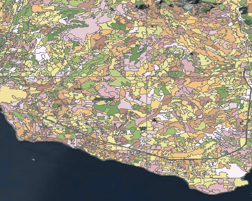
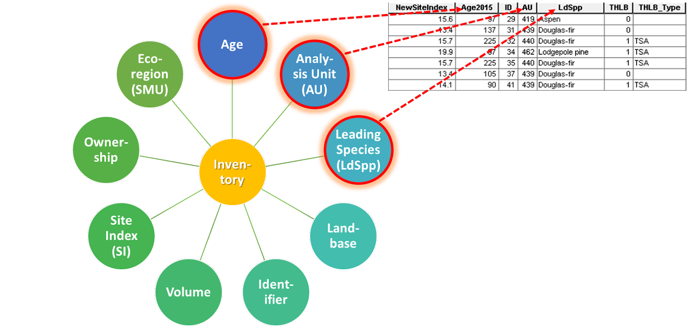
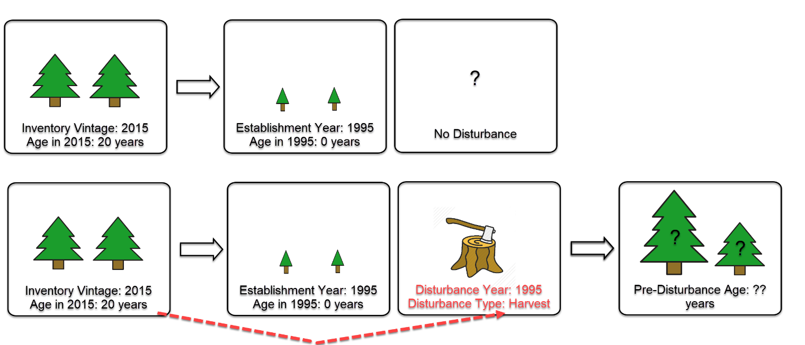
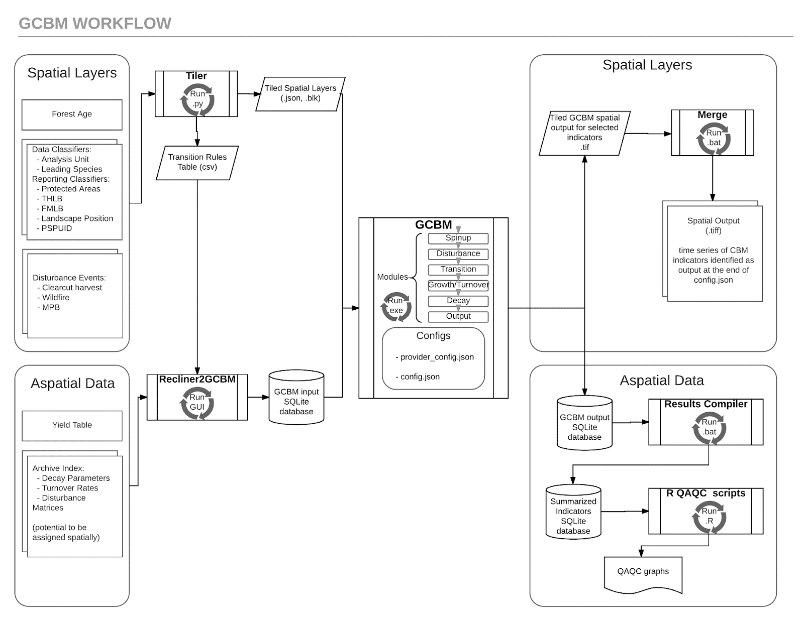

This case study provides workflow considerations for spatially explicit modelling of forest carbon budgets using the Generic Carbon Budget Model (GCBM) and FLINT (Full Lands INtegration Tool). The statements herein are based on personal experience using the tools to model various projects in Canada, ranging from the development of historic carbon stock and flux inventories to forward-looking mitigation analyses that explore forest management scenarios aimed as reducing net greenhouse gas (GHG) emissions. Model areas range from several thousand to several million hectares at resolutions of 1 km2 to 1 hectare, or even 0.25 hectares. Project areas have typically been focused in British Columbia, Canada, but have included projects in other provinces such as Ontario and New Brunswick.

Projects from different jurisdictions and with different objectives may encounter entirely different challenges than those that the team has encountered thus far. That said, the techniques and learnings presented in this case study may prove useful as suggestions and starting points for new users.

## Introduction and Overview of the Model

In partnership with various other agencies around the world, including major contributions from Australian colleagues, the Canadian Forest Service (CFS) is developing a spatially explicit forest carbon budget model. The model utilizes the [moja global](http://moja.global/) Full Lands Integration Tool (FLINT) and incorporates the science of the existing and widely used, spatially referenced Carbon Budget Model for the [Canadian Forest Sector CBM-CFS3](http://www.nrcan.gc.ca/forests/climate-change/carbon-accounting/13107). As FLINT is a generic integration tool, the model in development is termed the “generic” carbon budget model (GCBM).

At CFS, GCBM currently consists of a collection of scripts and executables that are utilized to prepare input data such as forest inventory and disturbance history, pass that input data into the GCBM/FLINT carbon budget model, and then organize result outputs.

> GCBM High-Level Overview

Each stage of this process can be further broken down into smaller steps, which are described in the next sections. 

## Input Data

Spatially explicit modelling makes use of data that is spatially described, which can also be thought of as maps of data. The reason for this is so that model parameters can be broken into spatially discrete chunks at whatever reference position, bounding area and resolution that the user requires.

<table>
    <tr>
        <td></td>
        <td></td>
        <td></td>
    </tr>
</table>

> Conceptual images of spatial data

Spatial data is supported by aspatial data such as yield curves, volume to biomass conversion factors and disturbance matrices that describe how carbon should accumulate and transfer with regular annual processes as well and unique disturbance events.

While spatially explicit modelling can provide the user with highly flexible and spatially accurate results, it also requires that data is very carefully prepared so that forest stand properties, disturbance event sequences and growth behaviors are appropriately organized and connected.

The following is a sample list of spatial and aspatial input data, each with descriptions of the types of parameters that might be derived from them. The next sections of this document describe data handling and preparation recommendations to ensure that inputs are properly prepared for use in GCBM/FLINT.

-   Forest inventory

    -   Stand polygon outline (position and geometry of forest stand properties).
    -   Age.
    -   Leading species, or species composition.
    -   Site index, or silvicultural intensity (growth performance).
    -   Silvicultural treatments such as thinning, prescribed burning or harvest.
    -   Harvest eligibility.
    

-   Harvest history

    -   Cutblock polygons.
    -   Year of harvest.
    -   Type of harvest (e.g. clearcut, selective, etc.).
    

-   Fire history

    -   Fire perimeter polygon.
    -   Year of fire.
    -   Fire severity if available.
    

-   Insect history

    -   Pest event polygon.
    -   Year of occurrence.
    -   Insect type (e.g. pine beetle, aspen defoliator).
    -   Severity class (e.g low, medium, high).
    

-   Management unit boundaries

    -   Boundary of management unit.
    -   Name.
    -   Unit code.
    

- Biogeoclimatic Ecosystem Classification / Ecoregion

    -   May define certain disturbance event behaviours, growth, decomposition parameters and biomass conversion coefficients
    

- Mean annual temperature

    -   May influence growth and decomposition parameters.
    

-   Growth and yield curves (aspatial)

    -   Comprehensive table containing all possible combinations of species, site index, etc. that occur in the forest inventory to define the growth dynamics of each stand type.
    -   Gross merchantable volume at specific and regular stand age increments.
    

-   Volume to biomass parameters

    -   Equations and/or factors that describe how to convert volume-based yield curves to carbon biomass.

-   Disturbance Types and Matrices

    -   Descriptions of how carbon should be transferred between various start and end pools, such as from merchantable stem carbon to dead stem snags after fire events, or from litter pools to the atmosphere during annual decay processes.
    -   Differentiated by type, severity, ecoregion, etc.

These different types of input data could be provided as georeferenced rasters (`.tif`), or ESRI shapefiles (`.shp`) or feature classes in a geodatabase (`.gdb`).  Tabular, aspatial data might be provided as a basic comma-separated-value text file (`.csv`), as an SQL database (`.db`), or as a Microsoft Excel workbook (`.xls`, `.xlsx`) or Access database (`.mdb`).

Each data format has constraints on file-size, type and complexity of information that it can store, as well as the way in which it may be queried and tooled. As an example, shapefiles are a highly versatile format that can be readily utilized by ArcGIS and Python-based tools; however, they cannot exceed a file-size of 2 gigabytes (GB).  Input data such as province-wide forest inventories often exceed the 2GB size limit. Raster-type data can be readily stacked, compared and quickly processed using array handling techniques, but they are challenging to link complex attribute sets to.

Data types, size and computing resources have a significant influence on the data preparation techniques that the user will need to employ to prepare inputs for GCBM.

## Data Preparation

The goal of input data preparation is prepare a consistent and error-free set of data that can be passed to GCBM/FLINT. Two support tools existing to help prepare the spatial data layers and the input database, called the “Tiler” and “Recliner2GCBM” respectively. These tools are described at the end of this case study. 

While the Tiler and Recliner2GCBM tools are extremely flexible and helpful, it is nonetheless recommended that additional data preparation, or “preprocessing” be carried out prior to passing data into them. The Tiler and Recliner2GCBM do not create or edit data for the user; their purpose is to read and organize data for use in GCBM/FLINT. The user must use their own manual steps of scripts to ensure that data are error-free and consistent, that data is created or adjusted where necessary, and that links to aspatial data are present and clear.

The initial subsections that follow describe some of typical and important types of input data that GCBM requires, and the types of data preprocessing that may be required. The final sections provide a brief description of the roles of Tiler and Recliner2GCBM.

### Forest Attributes

For spatially explicit forest carbon models, we must understand, pixel by pixel, the attributes of the forest. We require this information to model carbon dynamics such as growth and other annual processes such as decay and turnover.

The basic forest attributes that we require are:

1.  Tree type (e.g. species, genus, soft/hardwood)
2.  Age
    
Additional attributes that are required to provide better accuracy to carbon dynamics:

1.  Tree species  
2.  Site index (or some measure of productivity, e.g. analysis unit)
 
Supplementary attributes that further refine stand dynamics:

1.  Ecoregion  
2.  Biogeoclimatic Ecosystem Classification
3.  Mean annual temperature    
4.  Forest management unit
  
For attributes such as tree type and age, we need to understand these attributes at a stand level. So the attributes must be attached to a polygon, or possibly a cluster of raster cells.

>  Example of a detailed forest inventory from a region in British Columbia. Each polygon has unique species, age and site index characteristics.

The additional and supplementary attributes may or may not be wrapped together with the stand level information. In many cases, information such as ecoregion and forest management unit exist as broad, low detail polygons across large areas.

Jurisdictions (provinces, countries, etc.) and private companies typically maintain a “forest inventory” that contains detailed information about tree type and age. Due to the complexity of the information and large geographic area, these inventories can be very large (multiple gigabytes) and contain hundreds of thousands, or even millions of records.

When the data is stored in shapefile or feature class format, each forest stand polygon can be easily mapped to a long list of attributes. GCBM does not necessarily require all of these attributes; it requires those attributes that provide a link from the stand to a growth curve.  The required attributes for linking a stand polygon or pixel to a growth curve are called attributes.

> Classifier attributes in a forest inventory.

Through the use of manual and/or scripted steps, the user will need to identify and complete the following with their forest inventories:

1. Identify a list of values from each classifier category and ensure that there is an exact syntax match to the growth curve classifier values. For example, “Douglas-fir” may not match to “Douglas fir”.
    - Python libraries such as GeoPandas are useful for accessing and querying the attribute tables of spatial data.
2. Assess the size and complexity of the forest inventory, and the future processing requirements. If future processing with the forest inventory is required, it may be advantageous to grid the required inventory attributes into a raster format, to take advantage of threaded/blocked/multiprocessing techniques. 
    - Attributes such as Stand ID, Age, Species, etc. can be “pre-tiled” using the tiler, or rasterized with various other geoprocessing tools such as GDAL. 
3. Evaluate the inventory vintage (year it was produced), the desired start date of the model simulation, and the age range. A “rollback” procedure may be required to adjust the age of the forest stand for the simulation start.
4. Where possible, it is recommended that the user reduce the polygon complexity (i.e. number of vertices and/or features) and delete unnecessarily attributes. This can help ensure that errors associated with CPU/RAM resources do not occur, which are typically hard to identify that they are even happening.

### Disturbance Events

Disturbance events are mapped to pixels by overlaying spatially and temporally described events. Typical disturbance events are harvest, fire and insect, and may range from fully stand-replacing, to those that cause only partial mortality, or defoliation. Events may be described in separate shapefiles or feature classes, or they may be “baked-in” with forest inventory information in the case of silvicultural treatments such as thinning. 

A significant challenge with disturbance event information is that is may exist from several sources, with different affected areas and time spans. To avoid confusion and model failure in GCBM/FLINT, the user needs to manually, or through scripting, carrying out several recommended steps.

1. Decide on a single source of data for each unique disturbance type, or combine multiple sources into a single data layer. GCBM can not have two disturbance events of the same type occur in the same year. 
2. Carefully map the source of disturbance events of type to the time spans that they correspond to. Switching between data sources for a given disturbance type assumes that each source is methodologically consistent.
3. Clean out overlaps within the same disturbance type and year. Correct geometry errors.
4. If the data is large and complex, and will be required for inventory age adjustment processes (i.e., rollback) then consider gridding the data into a raster format. 
5. Identify a list of all disturbance types that will be used, and ensure that there is a corresponding match in the Archive Index Database.

It is important that the user become familiar with the spatial disturbance event information to identify and correct for errors. With that in mind, it can be advantageous to use the ArcPy toolset from ArcGIS, or various other GDAL tools combined with open source GIS tools, to interactively inspect and build data preparation scripts.

### Rollback, Simulation Start Age

Frequently, the vintage of the forest inventory that we work with will not correspond to the simulation start year. When we move the age of the forest stand, as reported in the inventory, back to the start of the simulation, we may encounter a situation where the age reaches zero. This means that a stand replacing disturbance event, such as harvest or fire, must have occurred to reset the age of the stand. The figures below provide some example rollback situations.

> In the most simple case, the age at the start of the simulation is determined with a straight forward value subtraction, in this case it would be 25 years.

> In other cases, the year of stand establishment matches a disturbance event. We know when the stand was established, but we do not know the age of the stand before the disturbance event. Determining the pre-disturbance stand age can be accomplished using an age probability distribution or through various other techniques.

>  If we are trusting the inventory information, it may happen that we need to create a disturbance because no event is present.

There are a wide variety of additional rollback situations that can occur. The purpose of mentioning it here is to highlight that a process is required to harmonize inventory age information and disturbance event information, so that there is a sensible sequence of events and parameters passed to GCBM.

The process typically involves stacking up various input data such as inventories of various vintages, different disturbance events, and then decided on a set of rules to resolve conflicts. When data is large and complex, the stacking and conflict resolution is easiest to handle when the inputs are simple raster arrays. In array format they can be handled with database tools and powerful Python numpy libraries.

For simple and small projects, rollback procedures are feasible within a GIS package and with basic GDAL tools.

The end goal of a rollback process is the following:

1. An age layer at the start of the simulation that makes sense.
2. Disturbance layers that have been adjusted to match the inventory, OR, an inventory that has been adjusted to match the disturbance information.
3. If required, transition rules to help resolve disturbance/inventory discrepancies.

### Future Events

Since GCBM/FLINT requires spatially described events, or map data, future event projections must be projected on to the forest landscape. Various Python/GDAL/ArcGIS tools can be used to accomplish this, and the procedures can range from placing events with a simple “birdshot” style blasts, to careful placement based on analysis of various spatial supporting layers. To-date, CFS has developed various versions of tools that project future harvest and future wild fire events. Some consist of open-source Python libraries and GDAL tools, while others make use of ArcGIS tools or paid optimization packages. Generic future projection tools have not yet been developed.

### Disturbance Types and Matrices (Archive Index Database)

Many projects have unique sets of disturbance events and matrices that guide the transfer of carbon between pools for those events. The disturbance event information from the input data, the tiler and the Archive Index Database (AIDB) must co-exist and match.

The AIDB is a collection of model parameters, such as volume to biomass parameters and disturbance matrices maintained by the CFS. The information is this database is ultimately fed into Recliner2GCBM and processed into a format ready for GCBM. 

The user can add information to the AIDB such as new disturbance event names and corresponding disturbance matrices, but they must ensure that all values are field mappings are correct. Python tools that pass information between spreadsheets and database, such as the SQLite and PyODBC libraries, are helpful to read and updated information in the AIDB.

### Growth and Yield

Description of forest growth (yield) is a critical component to GCBM/FLINT models. The input typically consists of a table with a set of growth curves. Each curve has a set of classifiers that can be linked to a forest polygon. The yield is often describe as a merchantable volume increment in steps of 5 to 10 years. 

### Tiler

The “Tiler” is a Python library that converts spatial data into a consistent format that GCBM/FLINT can work with. Some of the key steps that the tiler carries out are listed below.

1. Re-project data into a consistent projection and coordinate system. To ensure ease of use globally, a geographic coordinate system is used (i.e. latitude and longitude, no shape/length transformations.
2. Clip all data to a project “bounding box”
3. Split data into consistent, pixel sizes; e.g. 0.001 degrees by 0.001 degrees. Since a geographic coordinate system is used, the real-world size of each pixel may vary with latitude.
4. Anchor all data to a consistent reference point so that all pixels line up in perfect stacks.
5. Split data into spatial chunks to enable the use of threaded/block/multi processing tools.
6. Generate transition rules to be passed on to Recliner2GCBM.

### Recliner2GCBM

The executable called Recliner2GCBM is responsible for preparing the GCBM input database. It reads the Archive Index Database, yield curve library, and transition rules from the tiler to create a single SQLite databases with all aspatial parameters and that GCBM/FLINT will use.

## GCBM Data Objectives

In order to successfully complete a GCBM/FLINT model simulation the following two components are prerequisites, which are provided by the scripts and tools associated with Recliner2GCBM (1) and the Tiler (2).

1. An input database that describes:
    - Disturbance events
    - Disturbance matrices
    - Yield (growth) curves
    - Volume to biomass conversion factors
    - Decay/turnover equations and parameters
    - Associations between forest type, management unit, ecoregion
    - Transition rules
    - Accounting rules, etc.
2. A set of “tiled” data.

    - Tiled data is roughly equivalent a raster-format. It is a grid of data.
    - A configuration JSON file describes what each grid data value corresponds to. For example, a value of 2 on the species grid may correspond to Douglas-fir.
    - The JSON file may also describe transition rules or other post-event model behaviour such as a regeneration delay. These parameters are passed into the input database.

Each model simulation will typically have a unique set of tiled data; but, may share an input database provided the parameters do not require adjustment. Tiled inputs may be different depending on the model “scenario”. For example, in one scenario, historic harvest events may link to a disturbance type and matrix where utilization rates capture 85% of merchantable stem wood, while another scenario may link to a disturbance type and matrix where 95% is captured. 

In another example, future fire events in one scenario may cover twice the area compared to a business-as-usual (BAU) scenario. In one final example, harvest events may be followed up with residue burning in a BAU scenario, or substituted for residue capture for bioenergy in a comparative scenario.

The data that is directly input and output with GCBM/FLINT is described in the example process diagram below.

> GCBM workflow. The two key components discussed above and circled in blue. While the Tiler and Recliner2GCBM set of tools and scripts ultimately provide those components, many data preparation steps are required to first organize the data.

## Conclusion

The steps required to run a successful model simulation through GCBM/FLINT are dependent on the features of the input data, and the users modelling objectives. The workflow described in the flowchart below is a high-level generalization.

    </img>

