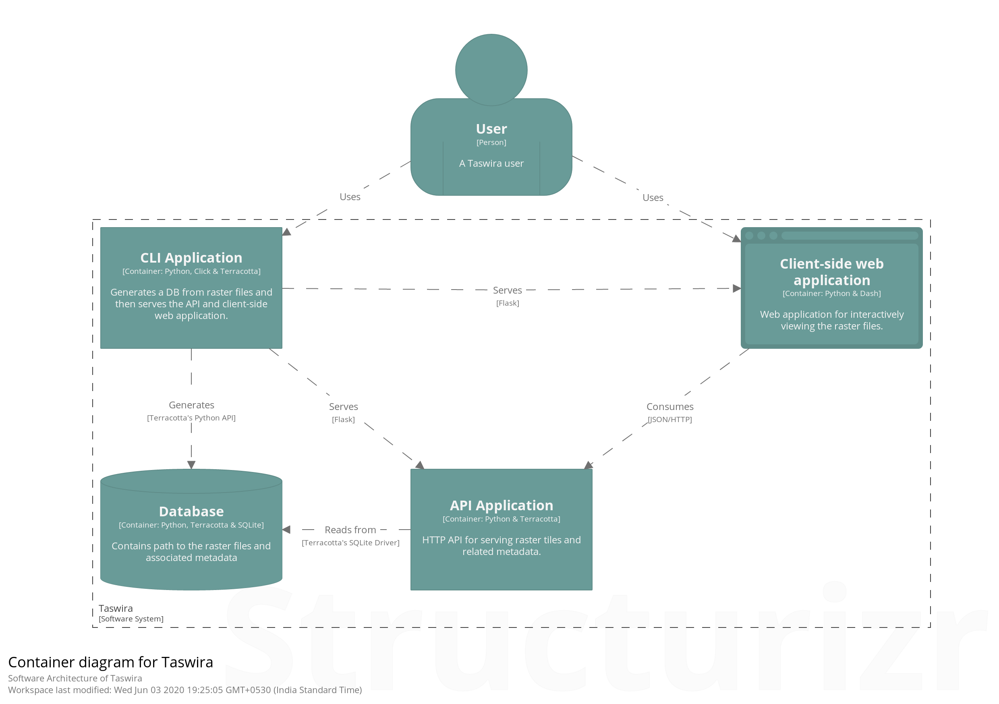

## Taswira

A data visualization tool is a form of a software that is designed to visualize data by creating images, diagrams, graphs or animations to communicate a message.

Taswira is a data visualization tool derived from "Swahili" word which means "visualize".

It is a GUI (Graphical User Interface) tool which aims to  be an easy-to-use utility to help the users of the Generic Carbon Budget Model (GCBM).

It takes output generated by GCBM and creates a browser-based UI that allows users to:-

    - View previews of the spatial data overlaid on an interactive map.
    - View graphs of ecosystem indicators from the non-spatial output.
    - Visually cycle through the time-series of the spatial output.

## Taswira Software Architecture

